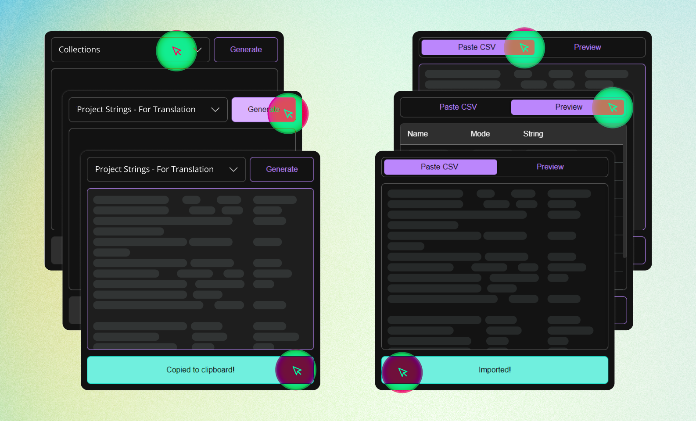

<!-- Improved compatibility of back to top link: See: https://github.com/othneildrew/Best-README-Template/pull/73 -->

<!--
*** ReadMe template provided by Best-README-Template.
-->

<!-- PROJECT SHIELDS -->
<!--
*** I'm using markdown "reference style" links for readability.
*** Reference links are enclosed in brackets [ ] instead of parentheses ( ).
*** See the bottom of this document for the declaration of the reference variables
*** for contributors-url, forks-url, etc. This is an optional, concise syntax you may use.
*** https://www.markdownguide.org/basic-syntax/#reference-style-links
-->
<!-- [![Contributors][contributors-shield]][contributors-url]
[![Forks][forks-shield]][forks-url]
[![Stargazers][stars-shield]][stars-url]
[![Issues][issues-shield]][issues-url]
[![MIT License][license-shield]][license-url]
[![LinkedIn][linkedin-shield]][linkedin-url] -->

<!-- PROJECT LOGO -->
 

  

  <h3 align="center">String-along</h3>

  

    Export/import your Figma string variables to and from any spreadsheet app.
     
    <a href="{figma}"><strong>Figma Community page »</strong></a>
     
     
    <a href="{demo}">Watch the Demo</a>
    ·
    <a href="https://github.com/kctdfh/string-along/issues">Report a Bug</a>
    ·
    <a href="https://github.com/kctdfh/string-along/issues">Request a Feature</a>
  

<!-- TABLE OF CONTENTS -->

  
Table of Contents

  <ol>
    <li><a href="#about-the-project">About The Project</a></li>
    <li><a href="#getting-started">Getting started</a></li>
    <li><a href="#usage">Usage</a></li>
    <li><a href="#roadmap">Roadmap</a></li>
    <li><a href="#contributing">Contributing</a></li>
    <li><a href="#license">License</a></li>
    <li><a href="#contact">Contact</a></li>
    <li><a href="#acknowledgments">Acknowledgments</a></li>
  </ol>

<!-- ABOUT THE PROJECT -->
## About The Project

</img>

<i>String-along</i> is a convenient Figma plugin designed to streamline the management of string variables within your design projects. With <i>String-along</i>, you can effortlessly export your string variables to a spreadsheet-compatible format, make edits or translations, and seamlessly import them back into Figma.

By providing a seamless bridge between Figma and your preferred spreadsheet software, <i>String-along</i> empowers you to efficiently manage and update text content across your designs. Whether you're working on a website localization project, updating copy for multiple screens, or simply need an organized way to collaborate on content design, <i>String-along</i> has you covered.

Features:

1. **Select any collection:** Easily export string variables from any of your collections in Figma. You have the flexibility to select the collections you want to export string variables from. As long as the collection has at lease one string variable, you can export their values with one click.

2. **Copy/paste friendly formatting:** The exported text is formatted in a way that allows you to directly paste it into any spreadsheet software of your choice. No cloud-tool authentication required. Effortlessly copy and paste the exported content into your spreadsheet and start editing.

3. **Simple Import:** Once you have made the necessary edits or translations in your spreadsheet, importing the updated values back into Figma is a breeze. Simply select the rows and columns containing the updated values, and copy/paste them directly into the <i>String-along</i> plugin. It will recognize the structure and map the values back to their respective string variables in Figma.

4. **Flexible Delimiter Support:** <i>String-along</i> offers the flexibility to choose any delimiter of your preference. Whether you prefer commas, tabs, or semicolons, <i>String-along</i> is designed to adapt to whatever you paste into it.

5. **Preview your changes:** When you paste your updated variables, the plugin will provide you with a tabular preview of the variable values and highlighting the values that will be updated.

6. **Support for line-breaks, punctuation, etc.:** Need a newline in your string? Want to use a punctuation that may or may not break a basic CSV parser? <i>String-along</i> handles all of these with no issues... that I know of! If you find one, <a href="https://github.com/kctdfh/string-along/issues">report it</a> please.

Limitations:

1. **Import Schema:** Currently, the import feature in <i>String-along</i> only supports the column schema of the exported spreadsheet. It means that you cannot upload any arbitrary spreadsheet for importing. The structure of the spreadsheet should match the exported schema.

2. **Creating Modes and/or Variables on Import**: Right now, the plugin only works as a way to update your existing variables. You can't create a new "mode" or a new variable at the same time as you import.

3. **Variable Aliases:** <i>String-along</i> does not fully support variable aliases at the moment. While the plugin allows you to export and import string variables, it may not handle aliases as expected. Open an <a href="https://github.com/kctdfh/string-along/issues">issue</a> if this is a deal-breaker for your use-case.

4. **Error Descriptions:** The error messages provided by <i>String-along</i> are not as descriptive as they could be. I'm working on improving the error handling to provide more detailed and useful descriptions.

5. **Component Text Field Limitation:** Unfortunately, Figma itself has a limitation where variables cannot be attached to component text fields. This limitation is inherent to Figma and not specific to <i>String-along</i> but it's worth mentioning. For more information on this limitation, you can refer to the discussion {here}.

As Figma's variable functionality evolves and the API reaches its final version, addressing these limitations will become a priority.

(<a href="#readme-top">back to top</a>)

<!-- GETTING STARTED -->
# Getting Started

* **Install it:** Click on <a href="{figma}">this</a> link and "Install" the plugin.

* **Run it:** You can either click on "Resources" in the toolbar, then select the "Plugins" tab, and search for "<i>String-along</i>". Or you can right-click anywhere on the canvas, hover your cursor over "Plugins" to open a list of all the plugins you've installed on Figma, and click on <i>String-along</i>. OR press `Command + /` or `Ctrl + /` and type <i>String-along</i>. If the plugin is already installed, each of its commands will appear for you to run.

(<a href="#readme-top">back to top</a>)

<!-- USAGE EXAMPLES -->
## Usage

* **Export:** Select the "Export string variables" plugin command. When the modal opens, select the collection you want to export from the dropdown input on the top-left and then click on "Generate". The resulting spreadsheet-compatible format of your string variables can be copied to your clipboard by clicking on the... well, giant "Copy" button!

* **Edit your variabled:** Go to your spreadsheet software, paste the variables, and get to editing. It's important that you don't change, edit, or add to the column headers. For now, you can only edit or remove any cell in the "String" column.

* **Import:** Copy your updated columns and cell and run the "Import string variables" plugin command. Click on the text area and paste it. If the parsing goes well, the "Preview" tab will be enabled. You can use it to check the parsing and see what is going to change when you click on "Import". Then you can go ahead and do just that to update your variables.

(<a href="#readme-top">back to top</a>)

<!-- ROADMAP -->
## Roadmap

### Pre-1.0
- [ ] Update the theme to match Figma's styling.
- [ ] Refactor the code to make it more contributor friendly.
- [ ] More descriptive errors.
- [ ] (Considering) Ability to export annotated frame PNGs of where each string variable is used.

### V 1.0 (after variables are out of beta)
- [ ] Re-write in Typescript and maybe move to Svelte for more sensible code-splitting.

### Future
- [ ] Create modes and variables on import.
- [ ] Arbitrary import schema support.

(<a href="#readme-top">back to top</a>)

<!-- CONTRIBUTING -->
## Contributing

Right now the code is in a "designer larping as developer" state. If you promise not to shame my abilities, you can fork the project, build your changes using `npm build`, and send a pull request. Bundling is done using Grunt and a few plugins for injecting CSS and JS.

(<a href="#readme-top">back to top</a>)

<!-- LICENSE -->
## License

Distributed under the MIT License.

(<a href="#readme-top">back to top</a>)

<!-- ACKNOWLEDGMENTS -->
<!-- ## Acknowledgments

(<a href="#readme-top">back to top</a>)
 -->

<!-- MARKDOWN LINKS & IMAGES -->
<!-- https://www.markdownguide.org/basic-syntax/#reference-style-links -->
[contributors-shield]: https://img.shields.io/github/contributors/othneildrew/Best-README-Template.svg?style=for-the-badge
[contributors-url]: https://github.com/othneildrew/Best-README-Template/graphs/contributors
[forks-shield]: https://img.shields.io/github/forks/othneildrew/Best-README-Template.svg?style=for-the-badge
[forks-url]: https://github.com/othneildrew/Best-README-Template/network/members
[stars-shield]: https://img.shields.io/github/stars/othneildrew/Best-README-Template.svg?style=for-the-badge
[stars-url]: https://github.com/othneildrew/Best-README-Template/stargazers
[issues-shield]: https://img.shields.io/github/issues/othneildrew/Best-README-Template.svg?style=for-the-badge
[issues-url]: https://github.com/othneildrew/Best-README-Template/issues
[license-shield]: https://img.shields.io/github/license/othneildrew/Best-README-Template.svg?style=for-the-badge
[license-url]: https://github.com/othneildrew/Best-README-Template/blob/master/LICENSE.txt
[linkedin-shield]: https://img.shields.io/badge/-LinkedIn-black.svg?style=for-the-badge&logo=linkedin&colorB=555
[linkedin-url]: https://linkedin.com/in/othneildrew
[product-screenshot]: images/screenshot.png
[Next.js]: https://img.shields.io/badge/next.js-000000?style=for-the-badge&logo=nextdotjs&logoColor=white
[Next-url]: https://nextjs.org/
[React.js]: https://img.shields.io/badge/React-20232A?style=for-the-badge&logo=react&logoColor=61DAFB
[React-url]: https://reactjs.org/
[Vue.js]: https://img.shields.io/badge/Vue.js-35495E?style=for-the-badge&logo=vuedotjs&logoColor=4FC08D
[Vue-url]: https://vuejs.org/
[Angular.io]: https://img.shields.io/badge/Angular-DD0031?style=for-the-badge&logo=angular&logoColor=white
[Angular-url]: https://angular.io/
[Svelte.dev]: https://img.shields.io/badge/Svelte-4A4A55?style=for-the-badge&logo=svelte&logoColor=FF3E00
[Svelte-url]: https://svelte.dev/
[Laravel.com]: https://img.shields.io/badge/Laravel-FF2D20?style=for-the-badge&logo=laravel&logoColor=white
[Laravel-url]: https://laravel.com
[Bootstrap.com]: https://img.shields.io/badge/Bootstrap-563D7C?style=for-the-badge&logo=bootstrap&logoColor=white
[Bootstrap-url]: https://getbootstrap.com
[JQuery.com]: https://img.shields.io/badge/jQuery-0769AD?style=for-the-badge&logo=jquery&logoColor=white
[JQuery-url]: https://jquery.com 
